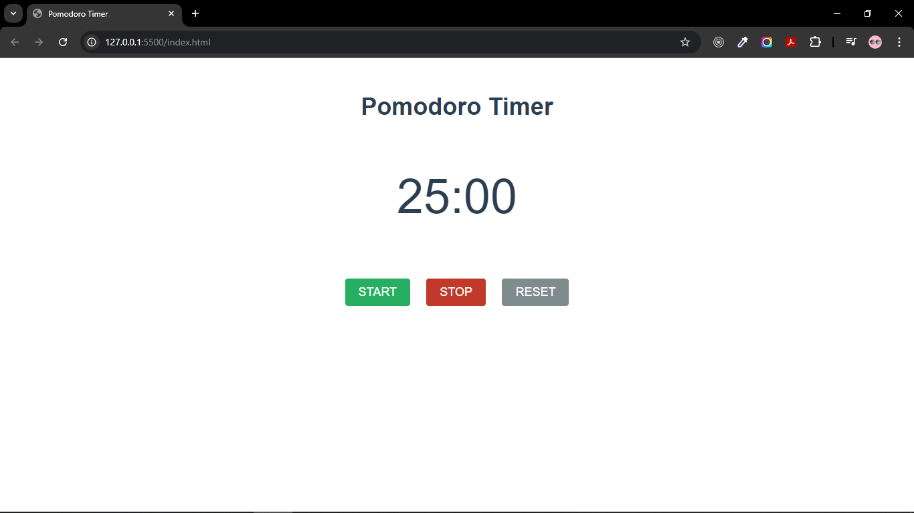
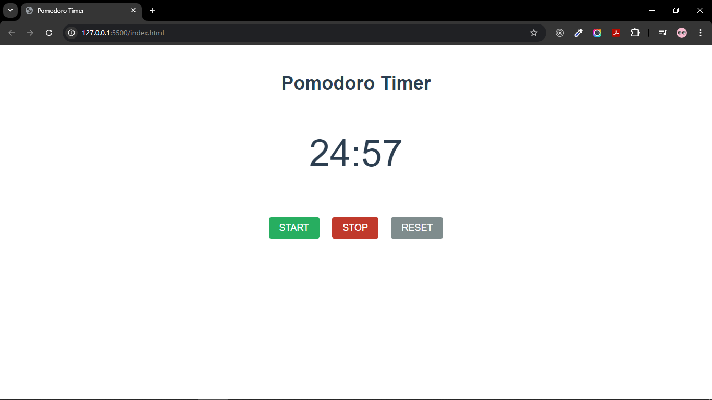
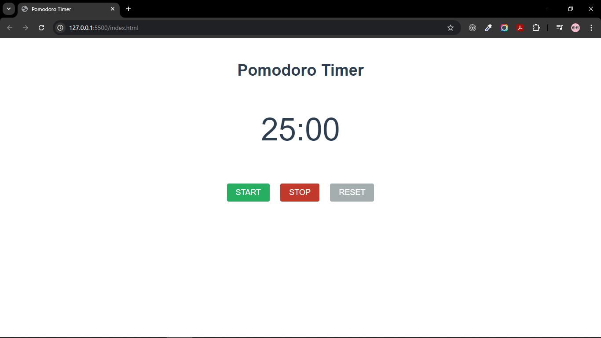
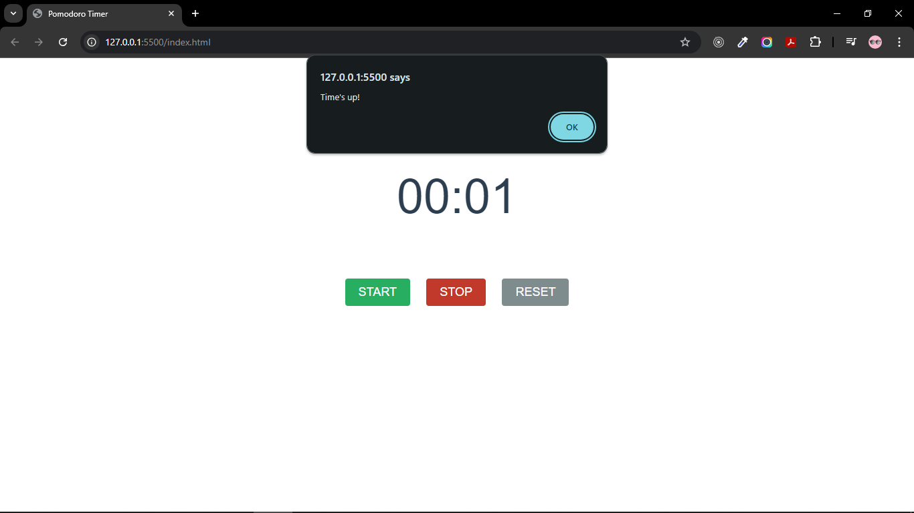

# Pomodoro Timer

##### we will create pomodoro timer with timer at the middle below that we have three buttons i.e start, stop and reset with alert when timer is over

##### we will use JS event listener and setInterval method to set and reset the timer 

**Timer**

**Timer with Start**

**Timer with Stop**

**Timer with Reset**

**Timer Alert**

### so we develop this app with
- HTML
- CSS
- JS 

[backlink](../Readme.md)